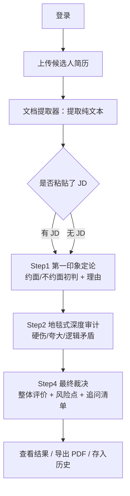

# 页面与流程

## 页面清单（结构化 Web 产品，面向招聘方）

| 页面 | 用户任务 | 核心信息 | 主要操作 | 入口/出口 |
| --- | --- | --- | --- | --- |
| 登录页 | 身份验证 | 账号/密码或 SSO | 登录 | 进入首页 |
| 首页/评估页 | 上传候选人简历、粘贴 JD、发起评估 | 使用说明、新评估入口 | 上传文件、输入 JD、发起评估 | 进入评估流程 |
| 评估进行中 | 等待分步输出 | 当前步骤进度（Step 1~4） | 取消、重试当前步 | 自动进入下一步 |
| 结果展示页 | 阅读分步评估结论 | 初判定论、硬伤审计、匹配度、追问清单（分步卡片） | 复制、导出 PDF、重新评估 | 导出 / 返回首页 |
| 历史记录页 | 回顾过往评估 | 会话列表（时间、候选人/简历名、结论摘要） | 打开、删除、继续 | 进入对应结果页 |

## 主流程（面向招聘方，4 步）

## 关键状态

| 对象 | 状态 | 触发条件 | 可执行操作 |
| --- | --- | --- | --- |
| 一次评估会话 | 待上传 → 提取中 → 评估中 → 已完成 → 失败 | 上传成功 / 逐步推进 / 全部完成 / 异常 | 上传、取消、重试、重新评估、导出 |
| 简历文件 | 待解析 → 已解析 | 上传完成 → 提取成功 | 重新上传、删除 |
| 结果 | 生成中 → 可阅读 → 已导出 | 某步输出完成 / 用户导出 | 复制、导出 PDF |
| 评估记录 | 进行中 → 已完成 | 评估结束 | 打开、删除、继续 |

## 失败/空/等待状态

- 文件解析失败（格式不支持/扫描件无文字）：提示重新上传或换格式。
- LLM 调用超时/失败：支持当前步骤重试，不丢失已完成的步骤。
- 未上传文件直接发起评估：引导先上传简历。
- 未登录访问：跳转登录页。
